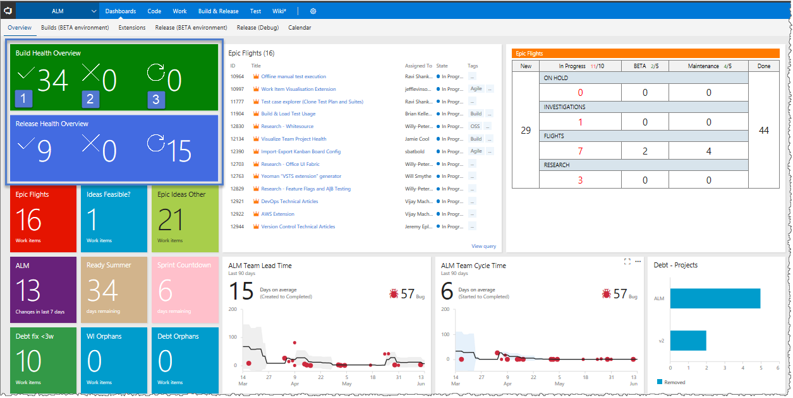
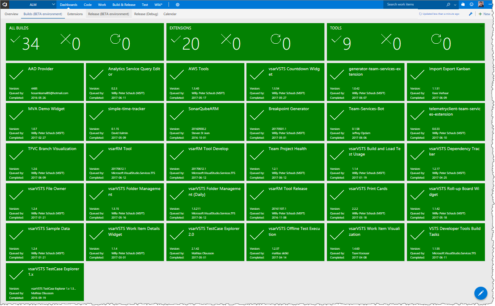
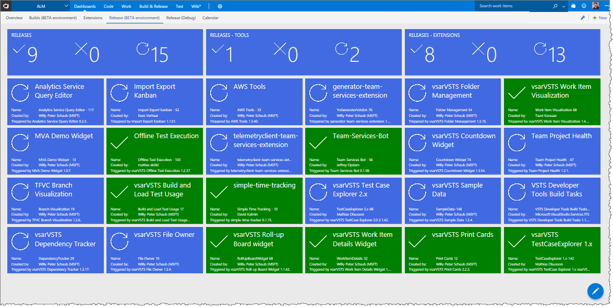
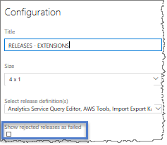

## Visualize-Team-Project-Health-Widgets

When you're running multiple CI/CD pipelines, it's invaluable to visualize the overall health of your projects. This extension contains several dashboard widgets, that enable users to create a visual cue on their dashboards, like the [Codify Build Light](https://github.com/Codify/build-light).

### Overview Widgets

Using the **Build Health Overview** and **Release Health Overview** widget you can add an overall status of your builds and releases to your dashboard. As shown, we have (1) thirty-four successful builds, (2) zero failed builds and (3) zero builds in progress. We also have 9 successful releases, zero failed releases, and 15 releases that are in progress. The widgets change its colour to **green** if everything is healthy, **blue** if anything is building, and **red** if anything has failed. 

### Build Details
By combining the **Build Health Overview** and the **Build Health Details** widgets you can create a build board that shows the same overview status and a detailed status for each build.

### Release Details
By combining the **Release Health Overview** and the **Release Health Details** widgets you can create a release board that shows the same overview status and a detailed status for each release. As shown, we have 15 releases that are in progress, which changed the colour of the **Release Health Overview** widget and associated **Release Health Details** widgets to blue.

When you're configuring your release widgets you have an option to handle rejected releases as failed releases.

## Known Limitations

- Until a Promise Polyfill hotfix is added to the web platform of TFS on-prem, this extension is **not** supported with Internet Explorer (IE) 11.**0**. 
- Only supported from TFS2017 Update 3 or higher, due to new API dependencies.

## Learn More

> Microsoft DevLabs is an outlet for experiments from Microsoft, experiments that represent some of the latest ideas around developer tools. Solutions in this category are designed for broad usage, and you are encouraged to use and provide feedback on them; however, these extensions are not supported nor are any commitments made as to their longevity.

[View Notices](https://marketplace.visualstudio.com/_apis/public/gallery/publisher/ms-devlabs/extension/TeamProjectHealth/latest/assetbyname/ThirdPartyNotices.txt) for third party software included in this extension.

## Contributors
We thank the following contributor(s) for this extension: [Wouter de Kort](https://blogs.msdn.microsoft.com/willy-peter_schaub/2014/01/21/introducing-the-visual-studio-alm-rangers-wouter-de-kort/), [Jakob Ehn](https://blogs.msdn.microsoft.com/willy-peter_schaub/2011/11/10/introducing-the-visual-studio-alm-rangers-jakob-ehn/), [Utkarsh Shigihalli](https://blogs.msdn.microsoft.com/willy-peter_schaub/2013/07/05/introducing-the-visual-studio-alm-rangers-utkarsh-shigihalli/), and [Ed Elliott](https://blogs.msdn.microsoft.com/visualstudioalmrangers/2016/02/15/introducing-the-visual-studio-alm-rangers-ed-elliott/).

## Feedback

We need your feedback! Here are some ways to connect with us:

- Add a comment in the Q&A section below and please add an actionable review.
- Send us an [email](mailto://mktdevlabs@microsoft.com).

Review the [list of features and resolved issues of latest tools and extensions](https://aka.ms/vsarreleases) for information on the latest releases.

## Contribute
Contributions are welcome. Here is how you can contribute:  

- Submit bugs and help us verify fixes  
- Submit pull requests for bug fixes and features and discuss existing proposals   

Please refer to [Contribution guidelines](.github/CONTRIBUTING.md) and the [Code of Conduct](.github/COC.md) for more details.